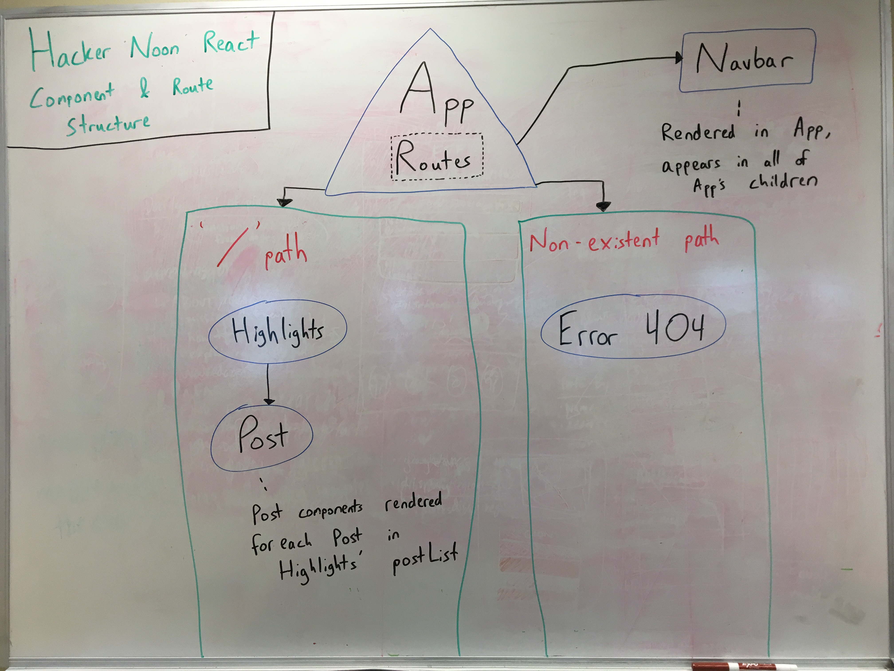

# Hacker Noon Clone in React

#### By **Ian Cook Westgate**

## Description

This clone of the Hacker Noon website is an app designed for Epicodus to practice cloning a website using the React framework. The links have no functionality. The final version will include posts brought in via a database using Firebase.

A key aspect of this project was converting an earlier Hacker Noon clone using an Angular framework into this one using the React library. For the most part, this was smooth and easy. React is a pleasure to work with and much simpler than what was, to me, the more complicated snarl of components & files of Angular. The only hiccup that occurred pertained to proper imports. Needing to import each individual image from the assets/images folder was a confusing change, and one that took me a little while to understand. Beyond that, it was a blast using React and I look forward to using it in the future over other frameworks/libraries out there.

## Component Structure

## Epicodus' README Prompt

* One unforeseen issue that popped up during my development process was figuring out how to get SCSS working with the project in a separate file. I wanted to do this to avoid making my components a mess of in-line styling in addition to all the HTML I needed to put together to make this project possible. I ended up banging my head uselessly on trying to do this myself for a substantial chunk of the morning. I ended up referring to an earlier template put together by a classmate to learn how he accomplished this. Turns out that, as much as I love React, there are a few things with it that aren't as intuitive when compared to Angular!

## Setup

* In your terminal, if you intend to view the code and want to make the React pages more legible, enter `apm install react`.
* Using your terminal, clone this repo by inputting `git clone https://github.com/iwestgate931/hacker-noonclone.git`.
* Navigate to the folder in the terminal by typing in: `cd Hacker-Noon-React`.
* In your terminal, enter `npm install` to install necessary dependencies.
* Then enter `npm run start` to prep the project to be viewed.
* In your web browser, go to `http://localhost:8080/` to see the project.

## Site Features

* Navbar recreates the neon green style of Hacker Noon.
* Most of the icons and imagery are in place, saved from Hacker Noon's page at the time of this clone's creation.
* Site is structured to resemble Hacker Noon's presentation.

## Planned Features

* Derive posts from a Firebase database.
* Tighten up the arrangement of posts to better match that of Hacker Noon's.
* Spend more time with CSS to properly format fonts, links, and post info.

## Technologies Used

* HTML
* CSS
  * SCSS
* JavaScript
* Node Packet Manager (NPM)
* Babel
* Webpack
* React
* ESLint

## Known Bugs

*
*
*

## Support and contact details

_Email iancookwestgate@gmail.com with any questions._

## License

This software is licensed under the MIT license.

Copyright (c) 2019 **Ian Cook Westgate**
